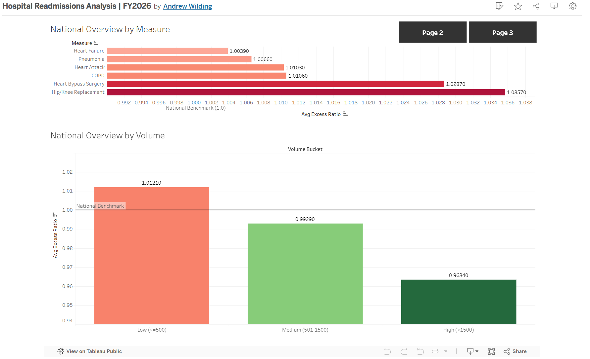

# Hospital Readmissions Quality Analysis | FY2026

## Project Overview
This project analyzes hospital readmission performance data from the Centers for Medicare & Medicaid Services (CMS) Hospital Readmissions Reduction Program (HRRP). The analysis identifies which conditions, states, and hospitals have the highest excess readmission rates relative to national benchmarks, and explores the relationship between hospital volume and readmission performance.

**Tools Used:** MySQL, Tableau  
**Skills Demonstrated:** Data cleaning, aggregation, CASE statements, NULLIF handling, exploratory analysis  
**Dashboard:** [View on Tableau Public](https://public.tableau.com/app/profile/andrew.wilding/viz/HospitalReadmissionsAnalysisFY2026/NationalOverviewDashboard)

---

## Dataset
**Source:** [CMS Hospital Readmissions Reduction Program — FY2026](https://data.cms.gov/provider-data/dataset/9n3s-kdb3)  
**Raw Rows:** 18,330  
**Cleaned Rows:** 8,037  

### Conditions Tracked
All six measures track 30-day readmission rates — whether a patient was readmitted to any hospital within 30 days of discharge:

| Code | Condition |
|---|---|
| READM-30-HIP-KNEE-HRRP | Hip/Knee Replacement |
| READM-30-CABG-HRRP | Heart Bypass Surgery |
| READM-30-COPD-HRRP | COPD |
| READM-30-AMI-HRRP | Heart Attack |
| READM-30-PN-HRRP | Pneumonia |
| READM-30-HF-HRRP | Heart Failure |

---

## Key Metric: Excess Readmission Ratio
The excess readmission ratio is the central metric in this dataset. A value of **1.0 is the national benchmark**:
- **Above 1.0** — hospital readmits more patients than expected (worse performance)
- **Below 1.0** — hospital readmits fewer patients than expected (better performance)

---

## Data Cleaning
The raw dataset required significant cleaning before analysis. A large portion of records were suppressed by CMS due to insufficient case volume — hospitals that don't see enough of a specific condition to produce statistically reliable results are excluded from reporting.

| Step | Rows Removed | Rows Remaining |
|---|---|---|
| Starting rows | — | 18,330 |
| Missing excess ratio (CMS suppressed) | 6,610 | 11,720 |
| Missing discharge count | 3,683 | 8,037 |

The 56% reduction from raw to cleaned data is itself a meaningful finding — the majority of hospitals in the US do not see sufficient volume of these specific conditions to be measured under the HRRP program.

Text values such as "N/A" and "Too Few to Report" in numeric columns were handled using nested NULLIF statements during import rather than post-import cleanup, keeping the pipeline clean and reproducible.

---

## Analysis

### 1. Performance by Condition
Hip/Knee Replacement has the highest average excess ratio nationally at **1.0357**, followed by Heart Bypass Surgery at **1.0287**. Heart Failure has the lowest at **1.0039**, likely reflecting decades of focused quality improvement efforts in heart failure management. Notably, all six conditions average above the 1.0 benchmark, suggesting systemic readmission challenges across the board.

### 2. Performance by State
Geographic performance varies significantly:
- **Best performing state:** Idaho (0.9144) — well below the national benchmark
- **Worst performing state:** Massachusetts (1.0444) — notable given Massachusetts is generally considered to have a high-quality healthcare system
- Western and Plains states tend to perform better than Southeastern and Northeastern states
- States below 1.0 are outperforming national expectations; states above 1.0 are underperforming

### 3. Volume vs. Performance
Higher volume hospitals consistently outperform lower volume hospitals — a well-documented phenomenon in healthcare known as the volume-outcome relationship:

| Volume Bucket | Avg Excess Ratio |
|---|---|
| Low (≤500 discharges) | 1.0121 |
| Medium (501–1500 discharges) | 0.9929 |
| High (>1500 discharges) | 0.9634 |

High volume hospitals not only perform better on average but also show less variance — the worst-case excess ratio narrows from 1.58 at low volume to 1.18 at high volume.

### 4. Worst Performing Hospitals
Carle BroMenn Medical Center in Illinois is the single worst performer in the dataset with an excess ratio of **1.5827** for Hip/Knee Replacement — 58% above the expected readmission rate. 17 of the top 20 worst performing hospitals are flagged for Hip/Knee Replacement, consistent with that condition's nationally elevated average.

---

## Files
| File | Description |
|---|---|
| `DataSetup.sql` | Database creation, table definition, and CSV import |
| `Analysis.sql` | All four analysis queries with comments |

---

## Dashboard Preview

*Built with Tableau Public — [View Interactive Version](https://public.tableau.com/app/profile/andrew.wilding/viz/HospitalReadmissionsAnalysisFY2026/NationalOverviewDashboard)*
